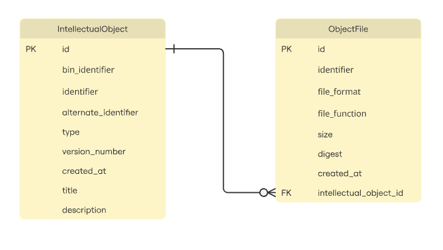
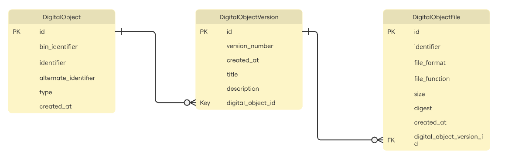

# dordataexperiment

This repository contains a Spring project with at least two alternative data models
presented that could be used in the dor-depot project. Both models produce almost
the same data, as seen by their mapping to `SummaryObject` in
[`CatalogService`](src/main/java/org/example/dordataexperiment/CatalogService.java).

## IntellectualObject

The current model centered around an `IntellectualObject` table that represents an 
object at a particular moment in time. Together the identifier and version number
identify a unique record. This model populates the `SummaryObject` using a database view
which is mapped to the `CurrentIntellectualObject` entity.

Run the [`IntellectualObjectBenchmarkTests`](src/test/java/org/example/dordataexperiment/IntellectualObjectBenchmarkTests.java)
to get a sense of this approach's performance for a handful of queries.

## DigitalObject

An alternative model where objects and versions are separated into two tables,
`DigitalObject` and `DigitalObjectVersion`. This model is more normalized,
because identifiers are not repeated within a single table.

How does a recursive approach fit in here? A version can't have a child version?
Well, we could consider introducing another table between `DigitalObjectVersion`
and `DigitalObjectFile` called something like `DigitalObjectComponent`, which could
be recursive and would have a `type` column with values like "fileset".

Run the [`DigitalObjectBenchmarkTests`](src/test/java/org/example/dordataexperiment/DigitalObjectBenchmarkTests.java)
to get a sense of this approach's performance for a handful of queries.

## Commentary

When satisfying the data retrieval needed for the object list view,
the `IntellectualObject` model/approach is more performant (~12 milliseconds,
compared to ~125 milliseconds), though both are acceptably fast. 
The `DigitalObject` model/approach could perhaps be optimized using a view
of its own. While it is a little hard to compare directly given that both
generated random data with random numbers of versions and files,
when fetching all of their data, both approaches are in the ballpark of ~4 or 4.5 seconds.

Since performance seems to be acceptable with both approaches,
the decision to go one way or another comes down to other factors,
such as programming ergonomics and whether we view normalization as having
important benefits for data description and analysis. Arguably,
the `DigitalObject` model/approach results in more transparent and readable code;
for example, we can see more clearly how a `SummaryObject` is constructed
in the `usingDigitalObjects` method on `CatalogService`,
where a `DigitalObject.getLatestVersion` method is utilized.
In general, having unique `DigitalObject` records provides a convenient, single entrypoint for
all queries about that object and its versions. Conversely, `IntellectualObject`
records need to be compared (every time) to determine whether they refer to the same object.

In the end, both approaches could be made to meet our business requirements,
but I feel a more normalized approach will be clearer to technical and business
staff and enable cross-version analysis and features.

## Resource(s)
- [Spring Data JDBC](https://spring.io/projects/spring-data-jdbc)